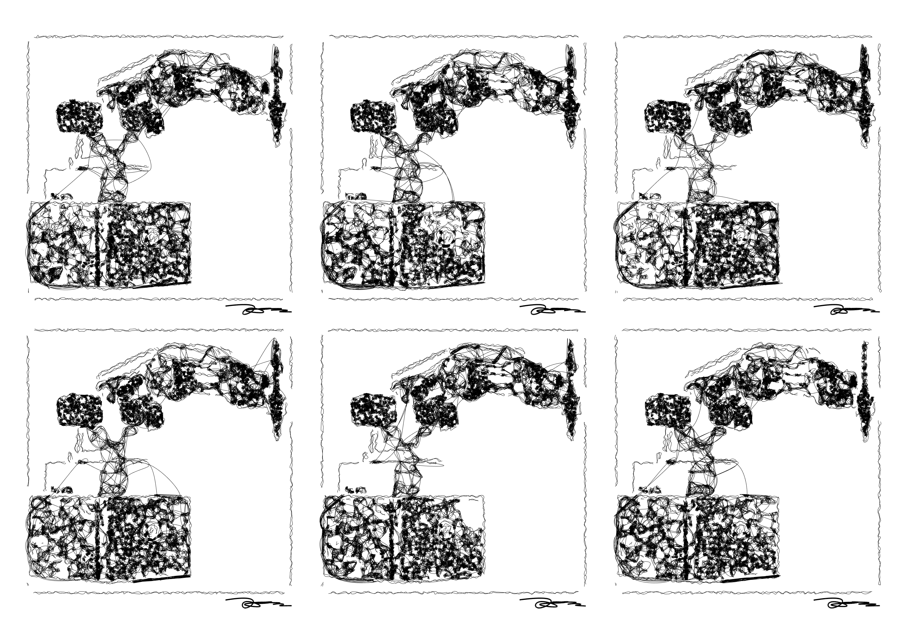

This project was inspired by Patrick Tresset's [*Human Study #2, La Vanité*](http://patricktresset.com/new/project/human-study-2-la-vanite/), an artistic installation piece that places several skeletally simple robots at old fashioned wooden desks while they produce scribbly sketches of whatever is placed in front of them. This piece has several key features that make not only its output but also its process fascinating. 
1. The robots never draw the same way twice. The planning process is somewhat random. 
2. The robots use both edges and shading information. Many other vision systems like [this one](https://www.ri.cmu.edu/wp-content/uploads/2019/01/Li-Mengtian-WACV-2019-Photo-Sketching.pdf) and [this one](http://www.cs.umanitoba.ca/~durocher/research/pubs/lbadAIM2012.pdf) focus only on edges because they are easy to characterize and render with line drawings. Using line drawings to make shading pushes this piece a step further than other projects. 
3. Scribbly, chaotic motion. 

Patrick Tresset's website provides no information that I could find about the algorithms behind his drawings, which are a foundational trade secret of his work. I experimented with a variety of ways to take RGB images and convert them into recognizeable but *artistic* line drawings. While my final style presented in this project does not perfectly recreate the effect of Tresset's work, it produces work at the same uncanny intersection of mechanical precision and sketchy freewheeling that Tresset's does. 

Tresset has other, better-documented work that was only found late in the process of developing this project. The technical details were not used in developing my work. The image processing techniques used are qualitatively very similar to the methods I found worked well but are, naturally, far more refined. The work presented in papers [like this](https://www.sciencedirect.com/science/article/pii/S0097849313000149) will offer an avenue for further improving the planning and processing steps if I work on this project further after this semester. 

