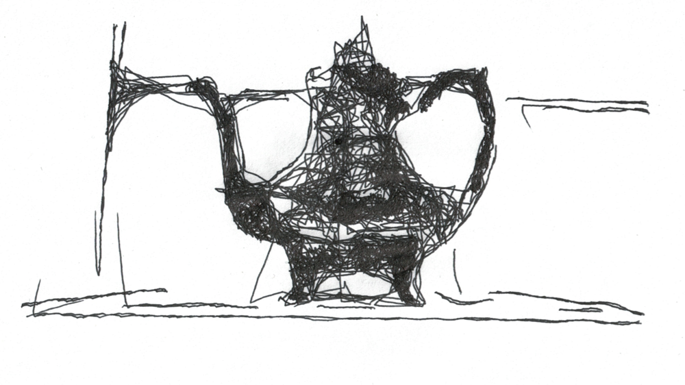
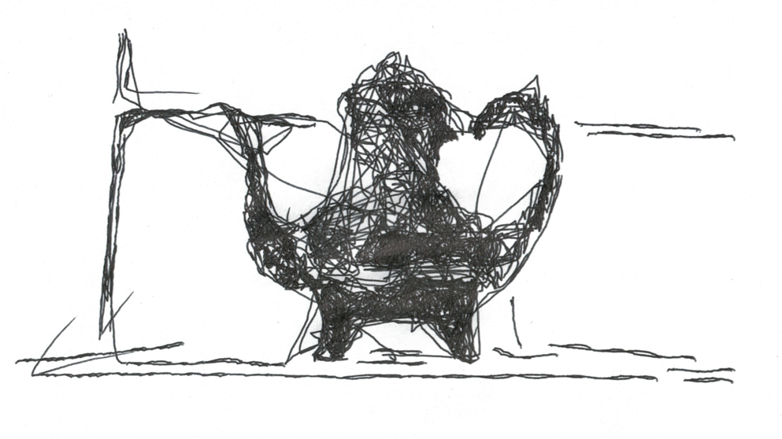
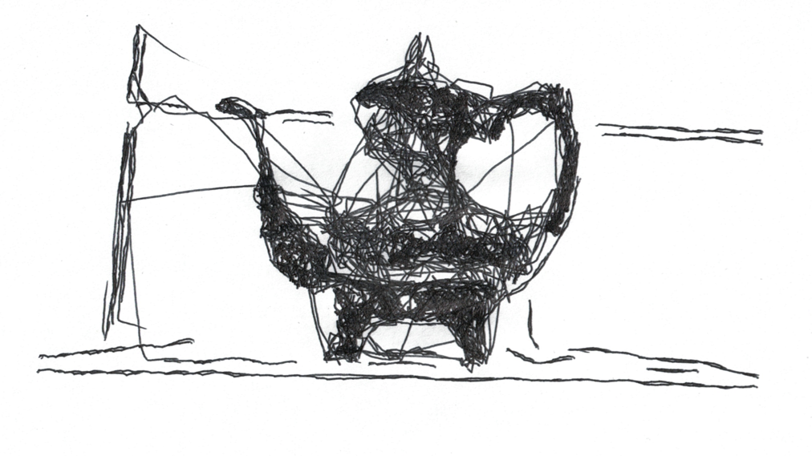
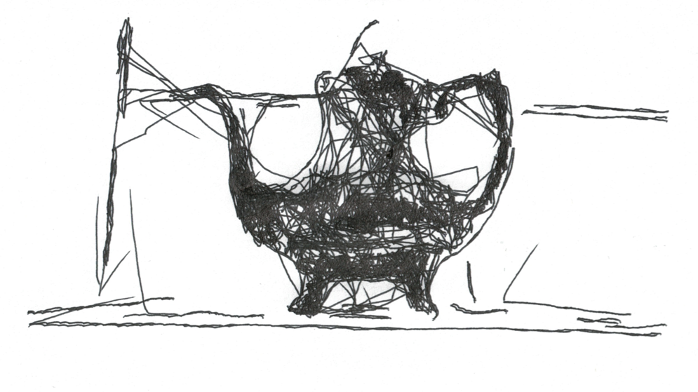
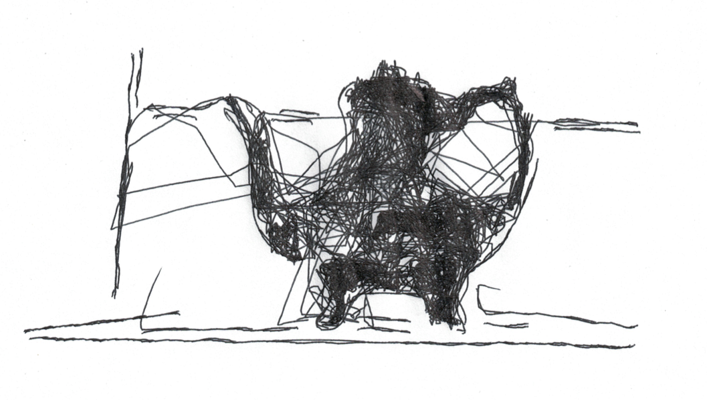
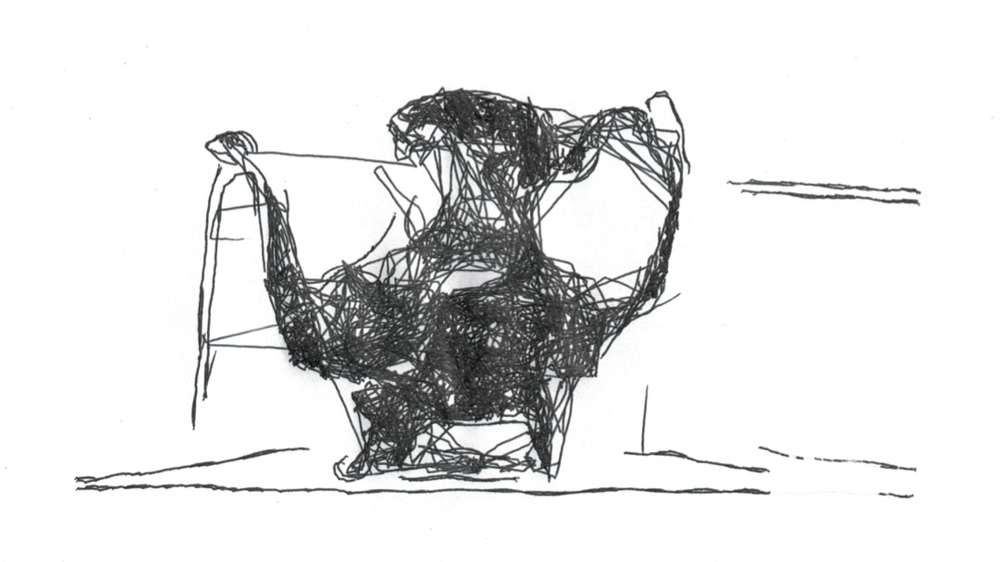
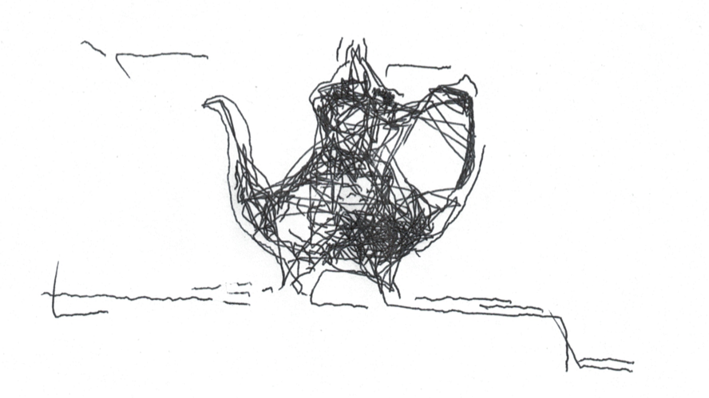

Chiaroscuro produces unsettling drawings that are never the same twice. All of these drawings show the same teapot with the same algorithm parameters and were drawn in about 30 minutes.

The demonstration image, with parameters to reduce drawing time to 10 minutes: 

