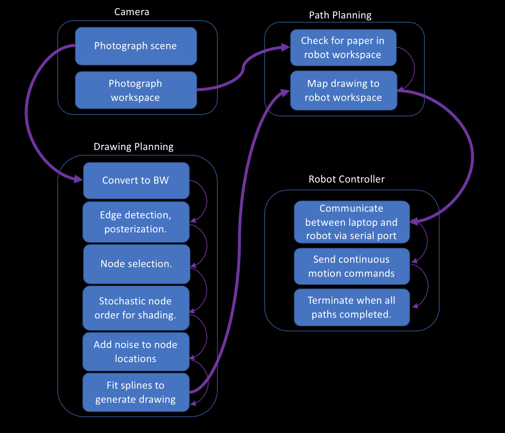
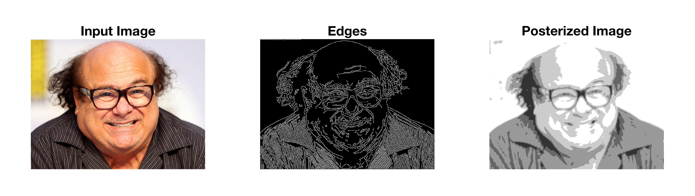
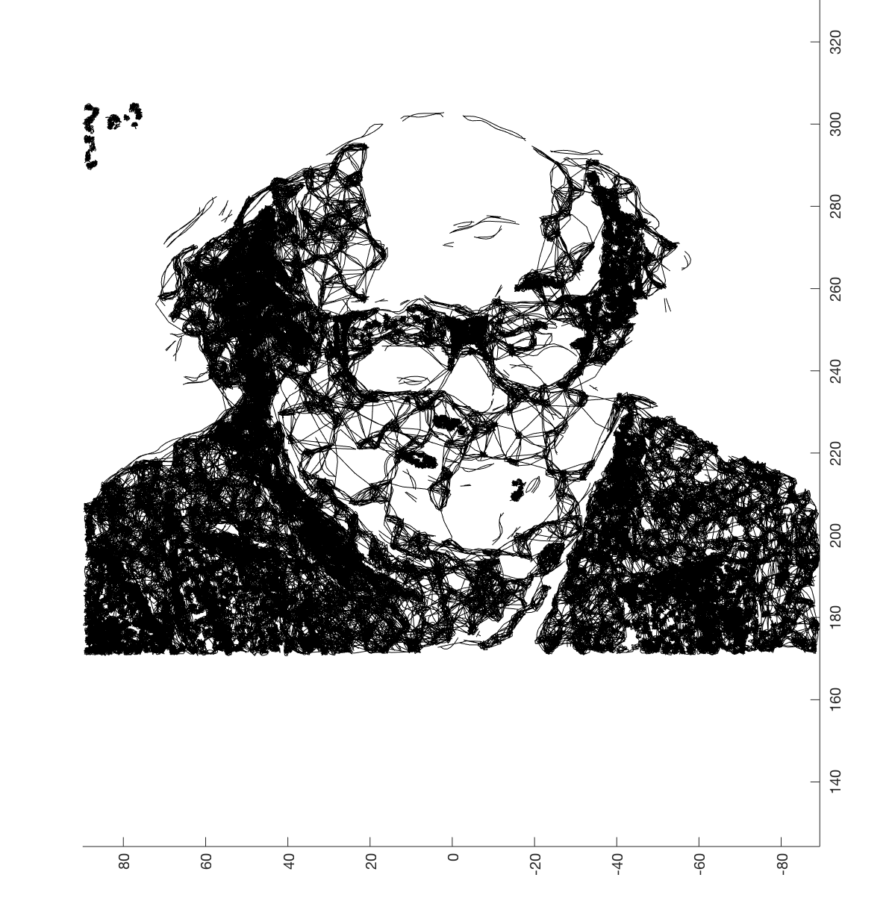
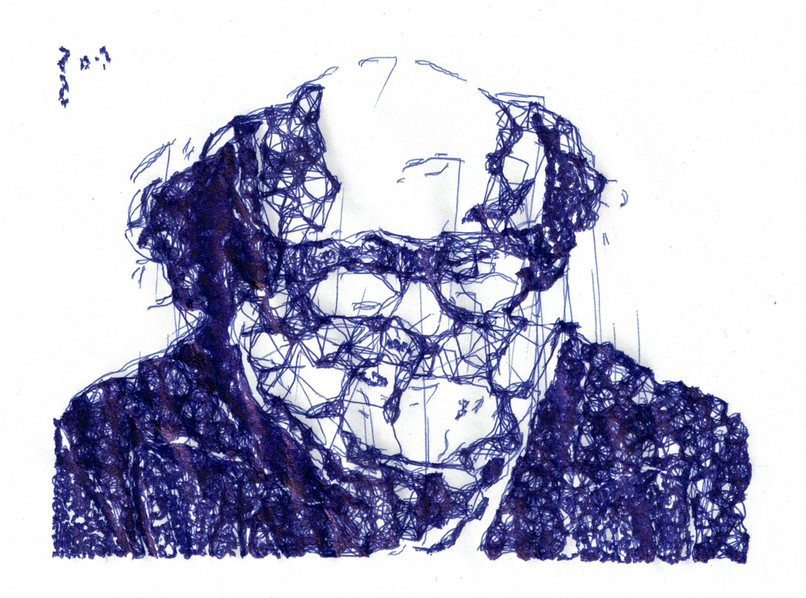

## Overall Workflow

## Hardware

This project uses a [Dobot Magician](https://www.dobot.cc/dobot-magician/product-overview.html) arm with a [logitech C920s](https://www.logitech.com/en-us/product/hd-pro-webcam-c920s) webcam. The webcam is mounted to the second link of the robot to allow the same camera to be used to check for a paper in the workspace and look in any direction instructed for the scene to draw. 

The setup currently uses a special short pen. Holding a regular-length pen with most of the length beneath the end of the arm allows the pen to wobble and completely removes fine shading features. If the pen is simply held higher up, the top end can press the *unlock* button for manually moving the Dobot, which causes the arm to go completely limp. This caused the robot to faceplant onto the paper during prototyping. 

## Drawing Planning

The core of this project is the ability to turn webcam images into planned line drawings. 

Many robotic art systems like [this one](https://www.ri.cmu.edu/wp-content/uploads/2019/01/Li-Mengtian-WACV-2019-Photo-Sketching.pdf) and [this one](http://www.cs.umanitoba.ca/~durocher/research/pubs/lbadAIM2012.pdf) only capture edges from reference photos. Edges are easy to detect and innately lend themselves to line drawings. However, they produce work that looks exactly how you would expect: precise and accurate but rather boring.

In order to create clear outlines, the algorithm first finds strong edges using a Canny detector, then filters for only edges with a clear beginning and end point (some edges are branching and cannot be rendered with a single continuous line) and removes edges that are too short. 

To create the shading plan, the algorithm segments a black and white version of the input image into contigous clusters of thresholded darkness values. It then randomly selected a subset of pixels from each cluster and uses the distance between pixels to compute a probability of jumping between all pairs of pixel coordinates. Without modification, this frequently creates small, repetive cycles. To break out of loops and create a more uniform drawing, the algorithm does two things: 

- Decreases the odds of returning to each point it visits by a constant factor. 
- Starts several random walks from random initial points. 

The core of this algorithm grew by trial and error. 

The combination of these steps usually fills in most of each cluster while still keeping the order and detailed appearance random every time. See the [gallery](\https://avery-rock.github.io/chiaroscuro/Gallery) section for examples of multiple drawings of the same scene with the same settings. 

## Path Planning

Currently, the robot is hard-coded with the location and size of the paper in its workspace. Once the drawing planning is complete, the planned path is scaled to the maximum size that can fit in the workspace (without changing its aspect ratio) and drawn in the upper left-hand corner. The only area of the workspace where a drawing of reasonable size can be made is directly in front of the robot. The entirety of a standard 8.5"x11" piece of paper cannot fit into the accessible workspace anywhere, and the available space is further reduced because the center of the workspace is approximately 120mm *above* the table. Using a long pen slightly expands the workspace at the expense of precision (see the *Hardware* section).

A more general version of this program could search the available workspace for a valid piece of paper, but for this project it was sufficient to check the one valid location. It does this by pointing the camera where it expects the paper to be and verifying that more than 90% of the pixels in the lower central region are lighter than the average pixel in the image. Placing the robot onto a light surface does NOT register as a piece of paper, and the paper must be well aligned to be accepted. 

## Robot Controller

Dobot provides support for several common platforms including ROS, C and Matlab. These support resources proved unreliable and poorly documented to use and none were compatible with use on MacOS. In order to produce a working minimum viable product, I pivoted and recreated the core communication scripts in Matlab in order to send serial messages directly from Matlab to the Dobot. This required writing custom scripts to convert coordinate data into Dobot's hexadecimal float format. 

The point-to-point control method reliably recreates planned drawings. The gains from continuous trajectories would be large for the edge drawing portion of the sketches but relatively small for the shading since the robot has to change directions all the time. 

## Future Improvements

A more polished version of this project has potential as an attraction at a street fair or similar environment where customers could sit for photos, watch the robot drawing other people, and purchase pre-made drawings of recognizeable landmarks or amusing still-life scenes. The algorithm would need to be tuned to render faces in a more flattering light. 

The current version of this project focuses on simplicity and reliability. There are several ways the speed, elegance and flexibility of the code could be improved, including: 

- Switching back to ROS, even at the expense of recreating communication protocols to enable asynchronous communication. 
- Using continuous trajectories instead of point-to-point control. 
- Making use of image histograms to automatically handle a larger number of drawing parameters. 
- Estimating total drawing time before starting (currently not supported). 
- Changing the order in which stages of the drawing are created so that the drawing can be terminated after a fixed amount of time. 

Tresset has better-documented work that was only found late in the process of developing this project. The technical details were not used in developing my work. The image processing techniques used are qualitatively similar to the methods I found worked well but are, naturally, far more refined. The work presented in [this paper by Tresset](https://www.sciencedirect.com/science/article/pii/S0097849313000149) offer an avenue for further improving the planning and image processing steps if I work on this project further after this semester.
