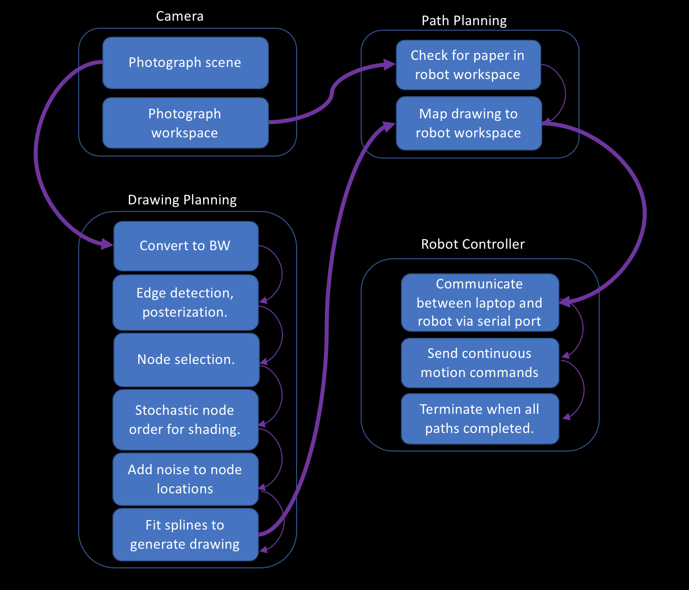
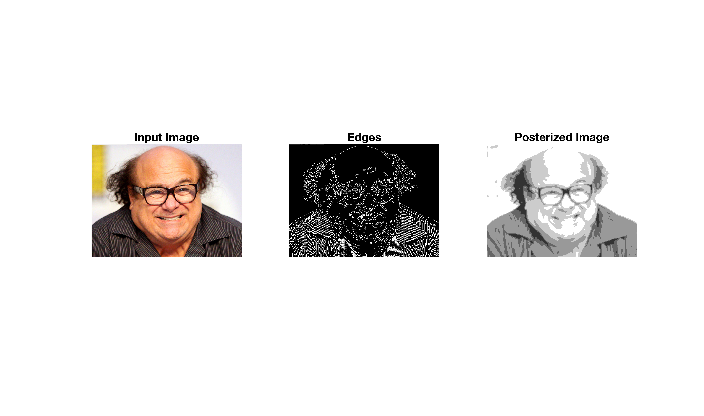
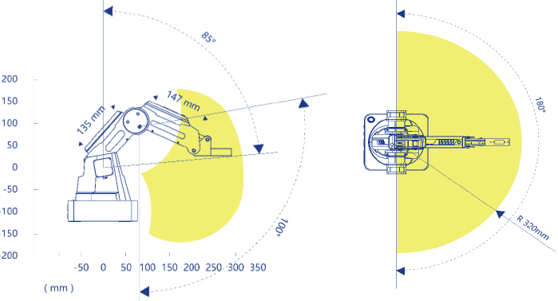

## Overall Workflow

## Hardware

This project uses a [Dobot Magician](https://www.dobot.cc/dobot-magician/product-overview.html) arm with a [logitech C920s](https://www.logitech.com/en-us/product/hd-pro-webcam-c920s) webcam. The webcam is mounted to the send link of the robot to allow the same camera to be used to check for a paper in the workspace and look in any direction instructed for the scene to draw. 

The setup currently uses a special short pen. Holding a regular length pen with most of the length beneath the end of the arm allows the pen to wobble and completely removes fine shading features. If a regular length pen is simply held higer up, the top end can hit the *unlock* button for manually moving the Dobot, which causes it to go into freefall if not held up. This caused the robot to faceplant onto the paper during prototyping. 

## Drawing Planning

The core of this project is the way it turns webcam images into planned line drawing paths. 

Many robotic art systems like [this one](https://www.ri.cmu.edu/wp-content/uploads/2019/01/Li-Mengtian-WACV-2019-Photo-Sketching.pdf) and [this one](http://www.cs.umanitoba.ca/~durocher/research/pubs/lbadAIM2012.pdf) focus only on edges. Edges are easy to detect and naturally lend themselves to line drawings. However, they produce work that looks exactly how you would expect: precise and accurate but rather boring. To create more interesting drawings, shading must also be created using lines. 

In order to mimic the disorderly shading style of Tresset's work, the algorithm first finds strong edges using a Canny detector, then filters for only edges with a clear beginning and end point (some edges are branching and cannot be rendered with a single continuous line) and removes edges that are too short. 

To create the shading plan, the algorithm segments a black and white version of the input image into contigous clusters of thresholded darkness values. It then randomly selected a subset of pixels from this cluster and uses the distance between them in the original image to compute a probability of jumping from one node to each other node. Without modification, this generally creates small loops since there are generally sets of pixels within each cluster that are relatively close to each other. To break out of loops and create a more uniform drawing, the algorithm does two things: 
- 1. Decreases the odds of returning to each point it visits by a constant factor. 
- 2. Starts several random walks from random initial points. 

The combination of these steps usually fills in most of each cluster while still keeping the order and detailed appearance random every time. See the Gallery section for examples of multiple drawings of the same scene with the same settings. 

## Path Planning

Currently, the robot is hard-coded with the location and size of the paper in its workspace. Once the drawing planning is complete, the planned path is scaled to the maximum size that can fit in the workspace (without changing its aspect ratio) and drawn in the upper left hand corner. The only area of the workspace where a drawing of reasonable size can be made is directly in front of the robot. A more general version of this program could search the available workspace for a valid piece of paper to draw on, but for this project it was sufficient to check the one valid location. 

## Robot Controller

Dobot provides support for several common platforms including ROS, C and Matlab. These support resources proved unreliable and poorly documented to use and none were compatible with use on MacOS. In order to produce a working minimum viable product, I pivoted and recreated the core communication scripts originally written in C in Matlab in order to send serial messages directly from Matlab to the Dobot. This required writing custom scripts to convert coordinate data into Dobot's hexadecimal float format. 

The current code is not asyncronous as a result of this implementation and sends a series of point-to-point translation commands based on the drawing plan. 

## Future Improvements

The current version of this project focuses on simplicity, reliability and fulfillment of deadlines to the exclusion of all else. There are several ways the speed, elegance and flexibility of the code could be improved, including: 

- Switching back to ROS, even at the expense of recreating communication protocols. 
- Using continuous trajectories instead of point-to-point control. 
- Making use of image histograms to automatically handle a larger number of drawing parameters. 
- Estimating total drawing time before starting (currently not supported). 
- Changing the order in which stages of the drawing are created so that the drawing can be terminated after a fixed amount of time. 
